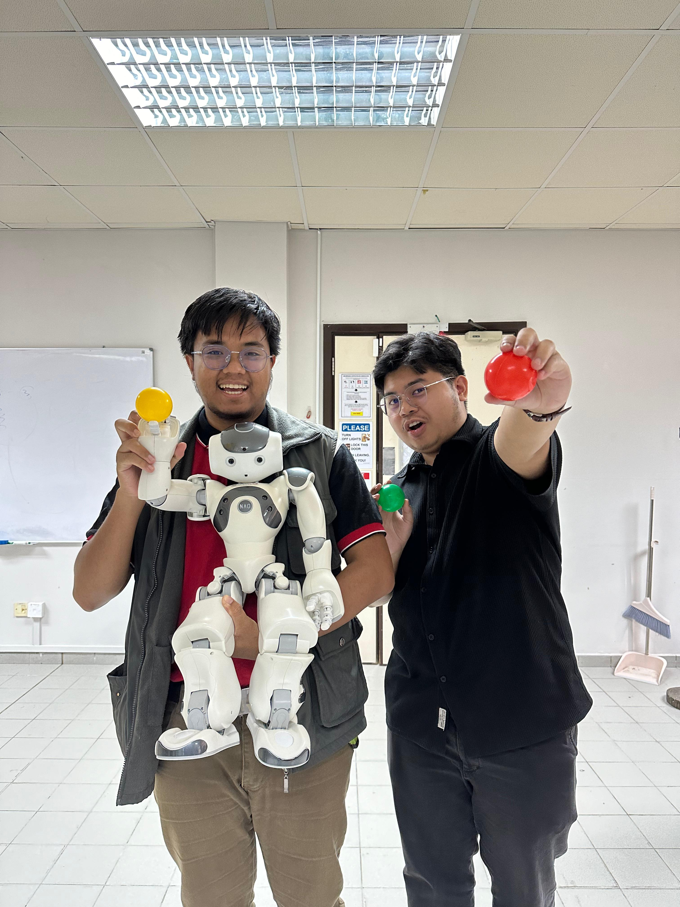

# NAO_THROWING_AND_PICKING_UP

<div align="center">
  
</div>

---

# **CONTENTS**
1. [About This Project](#🔴About-\space-This-\space-Project)
2. [Overview](#-🟢-${\color{green}-Overview}$)
3. [Project Files Description](#Project-Files-Description)
4. [Getting Started](#Getting-Started)
5. [Picking Up Function](#Picking-Up-Function)
6. [Target Finding Function](#Target-Finding-Function)
7. [Throwing Parameters Function](#Throwing-Parameters-Function)
8. [Aligning With Target Function](#Aligning-With-Target-Function)
9. [Main Function](#🟠Main-Function)


<hr style="border: 0; height: 5px; background-color: #f0f0f0; margin: 20px 0;">

<div align="center">

## ${\color{red} 🔴About  \space This \space Project}$

</div>

<div align="center">
  
</div>


Created by Universiti Brunei Darussalam (UBD) Students:
- 21B4059
- 22B6011


This code is part of an assignment for the module Intelligent Systems Lab, ZA-3201. Where the programming Language used was python. The code involves a humanoid robot called "NAO" from Aldebaran. NAO can be used to do various tasks or to used as it is with its default programmed settings. 

---

<div align="center">
  
## 🟢 ${\color{green} Overview}$  

</div>

In this project, NAO will perform a programmed sequence that involves grasping a soft ball, moving its arm to simulate a throwing motion, and releasing the ball towards a designated target area. This project will highlight NAO's capabilities in movement and interaction using Python programming.

Thus, the objectives are:
1. NAO to reach and grab a ball
2. NAO to find a designated target
3. NAO to throw the ball to the target

---

<div align="center">
  
## ${\color{yellow} 🟡Project \space Files \space Description}$

</div>
   
- **`NAO_throwing_and_picking_up.py`**: Main script that controls the NAO robot, guiding it through picking up the ball, finding the target, aligning with the target, and throwing the ball.
-  **`requirements.txt`**: Contains the required Python libraries and versions for running the project.
- **Helper functions**: Additional functions for controlling motion, calculating distances, and adjusting throwing parameters.

---

<div align="center">
  
## ${\color{orange} 🟠Getting \space Started }$  

</div>

### Prerequisites

- **Python 2.7** (required for NAO robot)
- **NaoQi SDK** (NAO’s communication library)
- **OpenCV** (for image processing)
- **NumPy** (for numerical operations)

### Setup

1. Clone the repository:
   ```bash
   git clone https://github.com/your-username/NAO-Throwing-Picking-Up.git
   cd NAO-Throwing-Picking-Up
   
2. Install the required dependencies using requirements.txt:   
  ```bash
  pip install -r requirements.txt
```
3. Ensure your NAO robot is connected to the same network as your PC. You’ll need to configure the robot’s IP and port in the script.

---

<div align="center">
  
## ${\color{blue} 🔵Picking \space Up \space Function }$  

</div>  

The **Picking Up Function** involves controlling NAO’s arm to grab a ball and secure it in its hand. Here is a line-by-line breakdown of the code:

```py
# Set the stiffness for the wrist to control the arm movement
motion_proxy.setStiffnesses("LWristYaw", 1.0)
```
This line sets the stiffness of the left wrist (LWristYaw) to 1.0, making the wrist rigid enough for precise movements when picking up the ball. The 1.0 value indicates full stiffness (fully controlled).
```py
# Move the wrist to a specific angle to face backwards and grab the ball
motion_proxy.setAngles("LWristYaw", 2.0, 0.2)
```
This line sets the angle of the left wrist (LWristYaw) to 2.0 radians, positioning the wrist in a way that it can grab the ball. The 0.2 value controls the speed of the movement (smooth, but not too fast).
```py
# Close the hand to ensure the ball is held securely
motion_proxy.setStiffnesses("LHand", 1.0)
motion_proxy.setAngles("LHand", 0.0, 0.2)
```
These two lines first set the stiffness of the left hand (LHand) to 1.0 to hold the ball tightly. Then, the LHand angle is set to 0.0, which would close the hand to grip the ball securely, at a moderate speed (0.2).
```py
# Ensure the arm is positioned securely to hold the ball
motion_proxy.setStiffnesses("LArm", 1.0)
motion_proxy.setAngles("LShoulderPitch", 0.5, 0.2)
motion_proxy.setAngles("LElbowYaw", -1.0, 0.2)

```
These lines set the stiffness for the left arm (LArm) and adjust the angles of the shoulder (LShoulderPitch) and elbow (LElbowYaw) to a position where the arm is bent and secure enough to hold the ball.
```py
# Hold the ball for a brief moment (simulate picking up)
time.sleep(0.5)
```

The time.sleep(0.5) causes the program to pause for 0.5 seconds, simulating the moment NAO is holding the ball before proceeding with any further actions.

---

<div align="center">
  
## ${\color{red} 🔴Target \space Finding \space Function }$  

</div>

In this section, NAO's target finding function will be explained. For this code, the target has been set to a green board with 40 cm width. By using Opencv library, this code uses HSV values to retrieve the target from NAO's camera.

A stand alone verison can be seen in `target_finding.py`

At first NAO subscribes to the camera by subscribing to ALVideoDevice which need NAO's IP and Port:
```py
video_proxy = ALProxy("ALVideoDevice", robotIP, PORT)
```
video_proxy is a variable that can be rename according to the users. ALproxy is a function that allows communication between the python code and NAO.

Then the video parameters needs to be setup:

```py
    # Set up video parameters
    resolution = vision_definitions.kVGA      # Use VGA resolution (640x480)
    colorSpace = vision_definitions.kRGBColorSpace  # Use RGB color space
    fps = 30                                 # Set frames per second to 30


    # Subscribe to video feed with specified parameters
    videoClient = video_proxy.subscribe("python_client", resolution, colorSpace, fps)
```

before any process occurs, lists are initilized to store multiple values that will be obtained in this function.

```py
        # Initialize lists to store multiple detections for averaging
        green_detections = []    # Store distances to green objects
        target_counts = []       # Store count of green objects found
        center_x_positions = []  # Store horizontal positions of objects
```

with this, we then need to extract the image dimensions from NAO's image data

```py
        # Extract image dimensions from NAO's image data
        imageWidth = naoImage[0]
        imageHeight = naoImage[1]
        array = naoImage[6]  # Raw image data is in the 7th element
```

After image retrival, using the tools from Opencv and numpy we convert raw image data into a numpy array. The array will then be converted into a Hue Saturation Value (HSV) space for colour detection

```py
        # Convert raw image data to numpy array and reshape to proper dimensions
        img = np.frombuffer(array, np.uint8).reshape(imageHeight, imageWidth, 3)
        # Convert from RGB to HSV color space for better color detection
        hsv = cv2.cvtColor(img, cv2.COLOR_RGB2HSV)
```

With the HSV space obtained, it will be fitted into a specified range of color .i.e in this code will be green. The range consists of a upper bound containing the highest possible value of green and a lower bound with the lowest possible value of green. Additionally, after fitting the image data, a binary mask is created for easy identification. Thus, any colour from the image data that was green will be converted into a white pixel with contours. While other colour than green will be converted into black

```py
        # Define HSV color range for green detection
        lower_green = np.array([35, 59, 21])   # Lower bound of green in HSV
        upper_green = np.array([85, 255, 255]) # Upper bound of green in HSV
        
        # Create binary mask where green pixels are white, others are black
        mask = cv2.inRange(hsv, lower_green, upper_green)
```

After we get the pixels, the contours are identified, counted and filtered to get a better result of the target. Furthermore, when the largest contour that is found the area,centerpoint and distance is calculated. This also applies to the other small contours.

**Where distance is the distance between NAO and the target**

```py
        # Find contours in the mask (handles different OpenCV versions)
        contours, _ = cv2.findContours(mask, cv2.RETR_EXTERNAL, cv2.CHAIN_APPROX_SIMPLE)
        
        # Filter out small contours (noise) by area
        significant_contours = [c for c in contours if cv2.contourArea(c) > 100]
        target_counts.append(len(significant_contours))
        
        if significant_contours:
            # Get the largest green contour
            largest_contour = max(significant_contours, key=cv2.contourArea)
            area = cv2.contourArea(largest_contour)
            
            # Calculate center point using contour moments
            M = cv2.moments(largest_contour)
            if M["m00"] != 0:  # Avoid division by zero
                center_x = M["m10"] / M["m00"]  # X coordinate of centroid
                # Convert to normalized coordinates (-1 to 1)
                normalized_x = (center_x - imageWidth/2) / (imageWidth/2)
                center_x_positions.append(normalized_x)
            
            # Calculate distance using apparent width
            apparent_width = math.sqrt(area)
            distance = (40 * 800) / apparent_width  # Simple distance formula
            green_detections.append(distance)
```

**The formula used is a variant of the well-known distance estimation technique that involves using similar triangles and the focal length of a camera.**

`distance = (40 * 800) / apparent_width`

where:
- `40` is the real-world width of the object.
- `800` is a scaling factor related to the camera setup.
- `apparent_width` is the measured width the largest pixel.

After all the calculation is done, we need to unsubscribe to the camera to control usage of NAO's camera to avoid NAO heating up.

```py
    # Clean up video subscription
    video_proxy.unsubscribe(videoClient)
```

With all the values, its median is obtain by using the numpy tool to enchance the result to find the target. If there is no value is obtained, then the code will return 0,0,0 for all the values

```py
        # If we have valid detections, return median values
        if green_detections and center_x_positions:
            final_distance = np.median(green_detections)
            final_count = int(np.median(target_counts))
            final_center_x = np.median(center_x_positions)
            return True, final_distance, final_count, final_center_x
        
        # Return default values if no detection
        return False, 0, 0, 0
```

---

<div align="center">
  
## ${\color{green} 🟢Throwing \space Parameters \space Function }$  

</div>

The **Throwing Parameters Function** calculates the optimal angles and speed for throwing the ball based on the target's distance. Here's a line-by-line breakdown of the code:

### `calculate_throw_parameters(distance)` Function:

This function calculates the shoulder pitch angle based on the distance to the target, adjusting the throw's aggressiveness. It also sets the throwing speed percentage accordingly.

```python
def calculate_throw_parameters(distance):
    """
    Calculate shoulder pitch angle based on distance with more aggressive angles
    """
    if distance < 50:  # Close range
        shoulder_pitch = 1.4857  # More forward angle
        speed_percentage = 20
    elif distance < 100:  # Medium-close range
        shoulder_pitch = 1.7857
        speed_percentage = 40
    elif distance < 150:  # Medium range
        shoulder_pitch = 1.8857
        speed_percentage = 60
    elif distance < 200:  # Medium-far range
        shoulder_pitch = 1.9857
        speed_percentage = 80  
    else:  # Far range
        shoulder_pitch = 2.0857  # Maximum forward angle
        speed_percentage = 100
    
    return shoulder_pitch, speed_percentage
```
- Close Range (distance < 50): A more forward shoulder pitch angle (1.4857) and low speed percentage (20%).
- Medium-Close Range (50 ≤ distance < 100): A slightly raised shoulder pitch (1.7857) and moderate speed percentage (40%).
- Medium Range (100 ≤ distance < 150): A further shoulder pitch (1.8857) and faster speed (60%).
- Medium-Far Range (150 ≤ distance < 200): An even steeper shoulder pitch (1.9857) and a higher speed (80%).
- Far Range (distance ≥ 200): The most aggressive shoulder pitch (2.0857) and maximum throwing speed (100%).
---

<div align="center">
  
## ${\color{yellow} 🟡Aligning \space With \space Target \space Function }$  

</div>  

In this section, the NAO's code for aligning with the target will be discussed. NAO moves with a tolerance of 10% if it is not aligned with the target. This tolerance is the threshold to determine if NAO is centered enough with the target. IF NAO is centered it say *Target is centered*.

**The tolerance can be adjusted for less or more precise alignment**

```py
       if abs(center_x) < 0.1:  # Target is centered (within 10% tolerance)
            tts_proxy.say("Target is centered")
            return True
```

Thus, this means if NAO is not within this threshold, NAO will adjust and announce if the target is on his left or right by using `motion_proxy.moveTo(0, 0, turn_angle)` and checking if the center_x is bigger than 0.

This means:
- 1 corresponds to the target being on the right
- 0 corresponds to the target being centered
- -1 corresponds to the target being on the left

The turn_angle is calculated by multiplying the calculated center of target (center_x) from the target finding function with 0.2. 0.2 is in radians which in degree is 11.5 degrees. This value is the limiter for turning NAO.

**0.2 is used for safety of NAO and its motor which prevents aggressive turning and destabilization** 

```py
        # Calculate turn angle based on center_x (-1 to 1)
        turn_angle = center_x * 0.2  # Max 0.2 radians turn
        
        # Announce direction
        if center_x > 0:
            tts_proxy.say("Target is to my right. Adjusting")
        else:
            tts_proxy.say("Target is to my left. Adjusting")
        
        # Turn to align with target
        motion_proxy.moveTo(0, 0, turn_angle)
        time.sleep(0.5)
        return True
```

if there was any error on this function, the function will return False, thus, in the main function, it will cause NAO to go to rest mode.

```py
    except Exception as e:
        print("Error in alignment:", e)
        return False
```


---

<div align="center">
  
## ${\color{orange} 🟠Main \space Function }$  

</div>  

In this section, all the function will be connected by calling it in order so that NAO will do all its motion in one go. Additonally, in this function, it also includes the throwing stance and action. 

To begin, all the necessary modules are initilized which are required in order for the other function to work.

```py
        motion_proxy = ALProxy("ALMotion", robot_ip, port)
        posture_proxy = ALProxy("ALRobotPosture", robot_ip, port)
        tts_proxy = ALProxy("ALTextToSpeech", robot_ip, port)
        video_proxy = ALProxy("ALVideoDevice", robot_ip, port)
```
Then, initially NAO will wake up from its rest and go its ready posture while looking down. The aim for for looking down is so that it can find the target better as it is on the ground.

**The head can be programmed to look at any angle that are possible**

Then, NAO will say *Looking for the green target* and call the target finding function, where in this code its called the ` detect_green_target(video_proxy)` . If the target is not found, NAO will go back to rest. NAO will also say the target distance as calculated from the target finding function.

```py
        tts_proxy.say("Looking for the green target")
        found, distance, target_count, center_x = detect_green_target(video_proxy)

        if not found:
            tts_proxy.say("Cannot find the green target")
            motion_proxy.rest()
            return

        # Announce target and distance
        tts_proxy.say("I found the green target at approximately {} centimeters".format(int(distance)))

```
Then after NAO finishes its sentence, it will begin to align itself with the target by calling the aligning with target function , `align_with_target`. If NAO could not align with the target, it will simply go back to rest

```py
       # Align with target
        if not align_with_target(motion_proxy, tts_proxy, center_x):
            tts_proxy.say("Failed to align with target")
            motion_proxy.rest()
            return

```
After aligning, NAO will being to move to the throwing stance. It will set his wrist backwards, hold the ball securely, look up and spread his legs. NAO will maintain the stance for 2 seconds after getting to it for stability.

**CAUTION: DO OBSERVE NAO'S MOVEMENTS AND AVOID IT FALLING**

```py
        # Set the wrist to face backwards
        motion_proxy.setStiffnesses("LWristYaw", 1.0)    
        motion_proxy.setAngles("LWristYaw", 2.0, 0.2)


        # Close the hand to ensure the ball is held securely
        motion_proxy.setStiffnesses("LHand", 1.0)
        motion_proxy.setAngles("LHand", 0.0, 0.2)
        time.sleep(0.5)

        # Prepare throwing stance
        tts_proxy.say("Preparing throwing stance")
        
        # Set stiffness to the whole body
        motion_proxy.setStiffnesses("Body", 1.0)

        # Define the target angles for a stable throwing stance
        # These angles are in radians
        target_angles = {
            "HeadPitch": 0.3,       # Head slightly up
            "LShoulderPitch": 1.5,  # Left shoulder raised
            "LShoulderRoll": 0.3,   # Left shoulder slightly outward
            "LElbowYaw": -1.2,      # Left elbow inward
            "LElbowRoll": -0.5,     # Left elbow bent
            "LWristYaw": 0.3,       # Left wrist adjusted
            "RShoulderPitch": 1.5,  # Right shoulder raised
            "RShoulderRoll": -0.3,  # Right shoulder slightly outward
            "RElbowYaw": 1.2,       # Right elbow inward
            "RElbowRoll": 0.5,      # Right elbow bent
            "RWristYaw": -0.3,      # Right wrist adjusted
            "LHipYawPitch": -0.3,   # Left leg outward
            "LHipRoll": 0.1,        # Left hip roll
            "LHipPitch": -0.4,      # Left hip pitch
            "LKneePitch": 0.7,      # Left knee bent
            "LAnklePitch": -0.3,    # Left ankle pitch
            "LAnkleRoll": -0.1,     # Left ankle roll
            "RHipYawPitch": -0.3,   # Right leg outward
            "RHipRoll": -0.1,       # Right hip roll
            "RHipPitch": -0.4,      # Right hip pitch
            "RKneePitch": 0.7,      # Right knee bent
            "RAnklePitch": -0.3,    # Right ankle pitch
            "RAnkleRoll": 0.1       # Right ankle roll
        }

        # Set the fraction of maximum speed for the movement
        fraction_max_speed = 0.1  # Move slowly to maintain balance

        # Apply the target angles
        for joint_name, angle in target_angles.items():
            motion_proxy.setAngles(joint_name, angle, fraction_max_speed)
            time.sleep(0.1)  # Small delay to ensure smooth movement

        # Delay for 2 seconds to maintain the pose
        time.sleep(2.0)
```
Then the throwing parameters are called, this is to enable NAO to swing his left arm according to the distance between itself and the target. NAO will then get his arm ready to throw. Before throwing, NAO will also tell its speed percentage. The throw motion is coded with the smallest possible value of time to make it quick resembling a catapult throw.

```py
        # Calculate throw parameters based on distance and target position
        shoulder_pitch, speed_percentage = calculate_throw_parameters(distance)

        # Prepare throwing position
        motion_proxy.setAngles("LShoulderPitch", -3.0, 1.0)
        motion_proxy.setAngles("LShoulderRoll", 0, 1.0)    
        motion_proxy.setAngles("LElbowRoll", 0.0, 1.0)
        motion_proxy.closeHand("LHand")
        motion_proxy.setStiffnesses("LWristYaw", 1.0)    
        motion_proxy.setAngles("LWristYaw", 1.0, 0.1)  # Set wrist based on target         
        time.sleep(0.5)

        # Execute throw
        tts_proxy.say("Throwing at {} percent power".format(speed_percentage))

        motion_proxy.setAngles("LElbowRoll", -1.0, 1.0)
        motion_proxy.setAngles("LShoulderPitch", -3.0, 1.0)
        time.sleep(0.1)
       
        # Explosive throw
        # Shoulder pitch is moved according to the distance and using maximum speed
        motion_proxy.setAngles("LShoulderPitch", shoulder_pitch, 1.0)
        motion_proxy.setAngles("LElbowRoll", 0.0, 1.0)
        motion_proxy.setAngles("LShoulderRoll", 0.0, 1.0)

        # Quick release
        time.sleep(0.1)
        motion_proxy.setStiffnesses("LHand", 1.0)
        motion_proxy.setAngles("LHand", 1.0, 1.0)
```

Lastly, NAO's arm will be returned back to set angle so that it can go to its standing position and then back to rest mode.

```py
        # Recovery with stance
        motion_proxy.setAngles("LShoulderPitch", 1.0, 0.5)  # Lower arm slowly
        time.sleep(0.3)
        
        # Return to safe position
        posture_proxy.goToPosture("StandInit", 0.5)
        motion_proxy.rest()
```

If there is any error on the flow of the main code, NAO will simply go to rest.

```py
    except Exception as e:
        print("An error occurred:", e)
        try:
            motion_proxy.rest()
        except:
            pass
```


